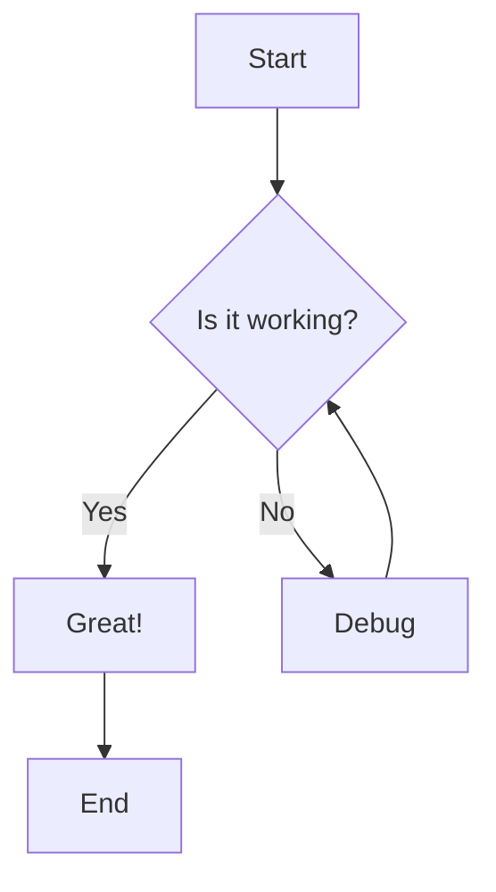
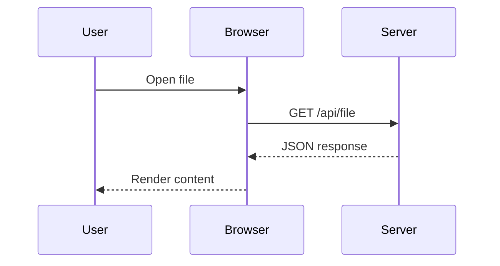
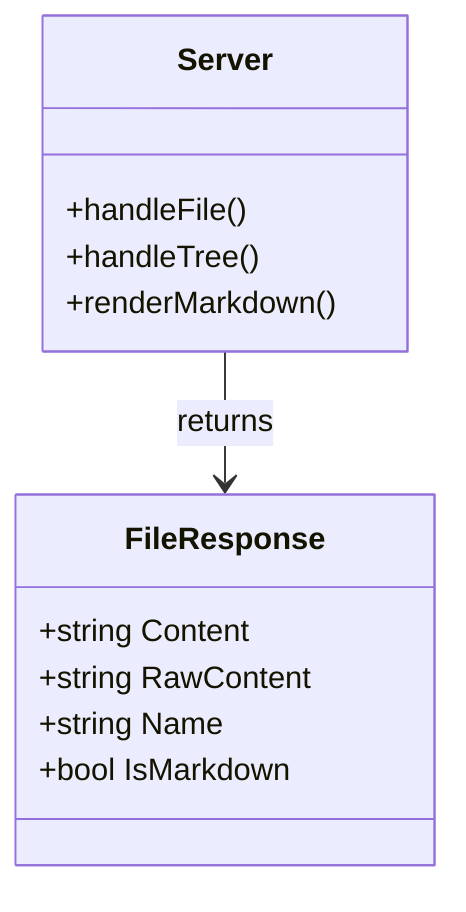
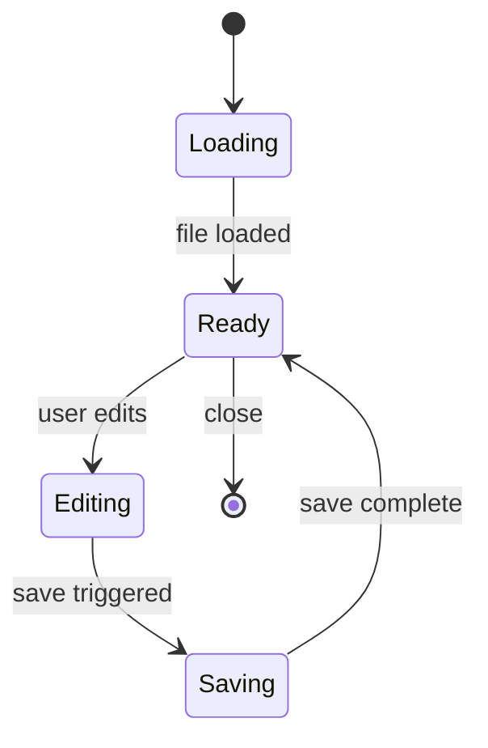
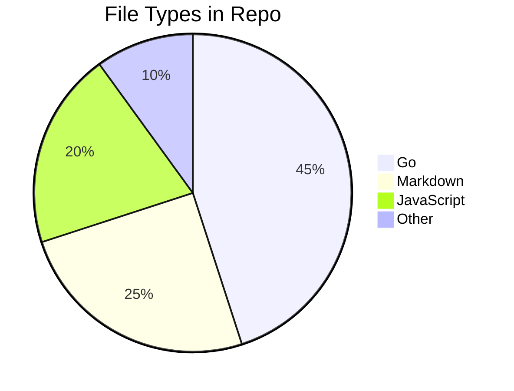

# Mermaid Diagram Examples

This file demonstrates Mermaid diagram rendering in RepoView.

## Flowchart

```mermaid
graph TD
    A[Start] --> B{Is it working?}
    B -->|Yes| C[Great!]
    B -->|No| D[Debug]
    D --> B
    C --> E[End]
```

## Sequence Diagram

```mermaid
sequenceDiagram
    participant User
    participant Browser
    participant Server
    User->>Browser: Open file
    Browser->>Server: GET /api/file
    Server-->>Browser: JSON response
    Browser-->>User: Render content
```

## Class Diagram

```mermaid
classDiagram
    class FileResponse {
        +string Content
        +string RawContent
        +string Name
        +bool IsMarkdown
    }
    class Server {
        +handleFile()
        +handleTree()
        +renderMarkdown()
    }
    Server --> FileResponse : returns
```

## State Diagram

```mermaid
stateDiagram-v2
    [*] --> Loading
    Loading --> Ready : file loaded
    Ready --> Editing : user edits
    Editing --> Saving : save triggered
    Saving --> Ready : save complete
    Ready --> [*] : close
```

## Pie Chart

```mermaid
pie title File Types in Repo
    "Go" : 45
    "Markdown" : 25
    "JavaScript" : 20
    "Other" : 10
```
